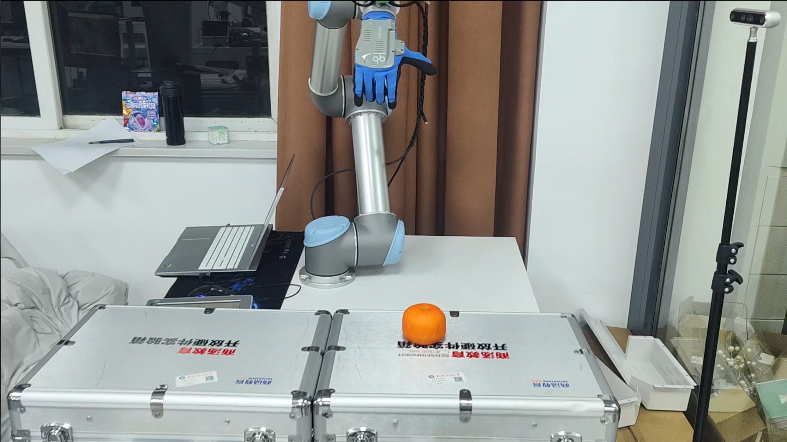
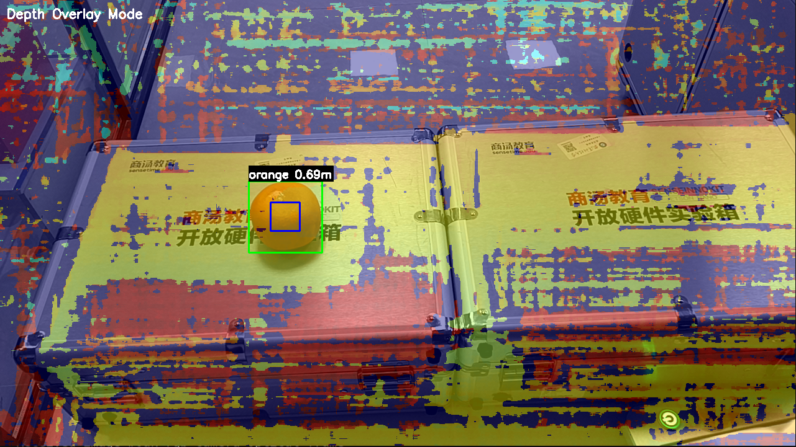

# UR5 机械臂视觉3d抓取系统

集成 UR5 机械臂、OAK-D 相机、QB Soft Hand 灵巧手的 ROS2 视觉协同系统。通过手眼标定实现在相机坐标系中识别物体，并转换到机械臂坐标系进行精确抓取。支持基于 YOLO 的物体检测与深度信息获取。

📺 项目演示与识别效果
1. 抓取流程演示 (Bilibili)

点击下方图片或徽章，即可跳转至 Bilibili 查看 UR5 机械臂配合 qbsofthand 的抓取演示：

<a href="https://www.bilibili.com/video/BV1Fo6qB3E5w/" target="_blank">
  
</a>

<br />

<a href="https://www.bilibili.com/video/BV1Fo6qB3E5w/" target="_blank">
  
</a>

2. YOLO 目标检测画面

这是系统运行过程中，通过 OAK-D 相机进行目标（橙子）识别的画面：



说明： 系统通过 yolo_center_detector 节点实时处理 /oak/rgb/image_raw 话题，提取目标中心坐标，并为 MoveIt2 提供抓取目标。

---

## ✨ 主要功能

- ✅ UR5 机械臂驱动与控制
- ✅ OAK-D 相机集成（RGB + 深度）
- ✅ QB Soft Hand 灵巧手控制
- ✅ ArUco 标记手眼标定
- ✅ YOLO 物体检测（支持 COCO 80 类）
- ✅ 实时深度信息获取（3D 定位）
- ✅ 坐标系变换与可视化
- ✅ **视觉抓取控制**（MoveIt2 集成）
- ✅ **一个简单的抓取demo**

---

## 📋 系统依赖安装

### 1. ROS2 系统包

```bash
sudo apt update
sudo apt install -y \
	ros-humble-cv-bridge \
	ros-humble-vision-msgs \
	ros-humble-image-transport \
	ros-humble-moveit\
	scipy
```

### 2. Python 依赖

```bash
# 使用 requirements.txt 安装（推荐）
pip3 install -r requirements.txt -i https://mirrors.aliyun.com/pypi/simple/

# 或手动安装
pip3 install ultralytics opencv-python -i https://mirrors.aliyun.com/pypi/simple/
pip3 install "numpy<2" "opencv-python<4.9"
```

### 3. 串口权限（灵巧手）

```bash
sudo usermod -aG dialout $USER
# 注销重新登录生效
```

---

## 🚀 快速开始

### 编译工作空间

```bash
cd ~/ros2_ws
colcon build --symlink-install
source install/setup.bash
```

### 日常启动（6 个终端）

```bash
# 终端 1：相机
ros2 launch depthai_examples rgb_stereo_node.launch.py

# 终端 2：机械臂
ros2 launch ur_robot_driver ur_control.launch.py \
	ur_type:=ur5 \
	robot_ip:=192.168.1.211 \
	launch_rviz:=false \
	reverse_ip:=192.168.1.10

# 终端 3：手眼标定发布（如在grasp_contol中的config文件中静态设置好了参数，可以不用启动该节点。注：该节点存在不稳定因素）
ros2 launch easy_handeye2 publish.launch.py name:=ur5_oak_eyehand

# 终端 4：灵巧手
ros2 run qbsofthand_control qbsofthand_control_node

# 终端 5：YOLO 检测
ros2 launch yolo_center_detector yolo_center.launch.py

# 终端 6：MoveIt2（抓取控制需要）
ros2 launch ur_moveit_config ur_moveit.launch.py ur_type:=ur5

# 终端 7：抓取控制
ros2 launch grasp_control grasp_control.launch.py

# 终端 8：触发抓取
ros2 service call /grasp_control_node/trigger std_srvs/srv/Trigger
```

---

## 📚 文档

| 文档 | 内容 |
|------|------|
| [01 连接ur5检查.md](01%20连接ur5检查.md) | UR5 启动、网络、测试 |
| [02 相机连接测试.md](02%20相机连接测试.md) | OAK-D 相机驱动与调试 |
| [03 softhand控制.md](03%20softhand控制.md) | 灵巧手控制方法 |
| [04 手眼标定.md](04%20手眼标定.md) | **关键**：完整标定流程 |
| [05 yolo识别.md](05%20yolo识别.md) | YOLO 物体检测与深度获取 |
| [06 物体识别抓取.md](06%20物体识别抓取.md) | **核心**：视觉抓取控制 |

---

## 🤖 YOLO 物体检测

支持检测 COCO 80 类物体（person, bottle, cup, orange 等）并获取 3D 位置信息。

```bash
# 启动检测（自定义物体清单）
ros2 run yolo_center_detector yolo_center_node \
	--ros-args \
	-p model_path:=/home/rvl/ros2_ws/src/yolo_center_detector/resource/models/yolo26s.pt \
	-p image_topic:=/color/video/image \
	-p depth_topic:=/stereo/depth \
	-p target_list:="[orange,person,bottle,cup]" \
	-p conf:=0.3

# 查看检测结果
ros2 topic echo /centers        # 中心点 + 深度（米）
ros2 topic echo /detections     # 完整检测信息

# 可视化
ros2 run image_tools showimage --ros-args -r image:=/detections_visualization
```

详见 [05 yolo识别.md](05%20yolo识别.md)

---

## 🛠️ 工具脚本

- `tools/aruco_transform_to_tf.py` - ArUco TF 转发（当识别到标记但 TF 不发布时使用）
- `tools/ur_send_small_trajectory.py` - UR5 运动测试脚本

---

## 📦 项目结构

```
ros2_ws/
├── src/
│   ├── grasp_control/           # 抓取控制包（本项目）
│   ├── yolo_center_detector/    # YOLO 检测包（本项目）
│   ├── qbsofthand_control/      # 灵巧手控制包（本项目）
│   ├── Universal_Robots_ROS2_Driver/
│   ├── depthai-ros-humble/
│   ├── easy_handeye2/
│   └── aruco_ros/
├── tools/
│   ├── aruco_transform_to_tf.py
│   └── ur_send_small_trajectory.py
├── requirements.txt             # Python 依赖
├── 01-06.md                     # 详细文档
└── README.md
```

---

## 🔧 故障排查

### NumPy 版本冲突
```bash
pip3 install "numpy<2" "opencv-python<4.9" -i https://mirrors.aliyun.com/pypi/simple/
```

### 深度值为 0
- 确认深度话题正确：`ros2 topic list | grep depth`
- 检查相机输出：`ros2 topic echo /stereo/depth --once`
- 某些区域（太近/太远/反光）可能无深度

---

## 🔗 参考资源

- [ROS 2 Humble 文档](https://docs.ros.org/en/humble/)
- [UR ROS2 驱动](https://github.com/UniversalRobots/Universal_Robots_ROS2_Driver)
- [easy_handeye2](https://github.com/marcoesposito1988/easy_handeye2)
- [depthai-ros](https://github.com/luxonis/depthai-ros)
- [Ultralytics YOLO](https://docs.ultralytics.com/)