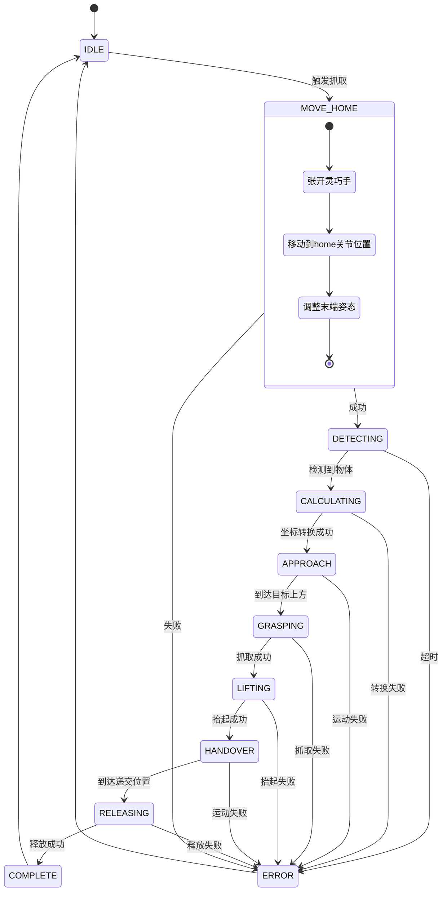

# 抓取策略改进方案

## 当前问题

当前的抓取流程在 **APPROACH** 阶段才调整末端执行器姿态，导致：
- 在接近物体时机械臂需要同时调整位置和姿态
- 可能增加碰撞风险
- 运动不够流畅

### 当前流程

```
MOVE_HOME: 张开手 → 移动到 home 关节位置
    ↓
DETECTING: 等待 YOLO 检测
    ↓
CALCULATING: 计算目标坐标
    ↓
APPROACH: 使用 MoveIt2 移动到目标上方（此时才调整姿态）← 问题点
    ↓
GRASPING: 闭合手抓取
    ↓
LIFTING: 抬起物体
    ↓
HANDOVER: 移动到递交位置
    ↓
RELEASING: 张开手释放
```

## 改进方案

### 新流程设计

```
MOVE_HOME: 
  1. 张开灵巧手
  2. 移动到 home 关节位置
    ↓
DETECTING: 等待 YOLO 检测
    ↓
CALCULATING: 计算目标坐标
    ↓
APPROACH: 
    1. 使用 MoveIt2 调整末端执行器到预抓取姿态（配置文件中的 orientation）
    2. 保持姿态，仅移动位置到目标上方
    ↓
GRASPING: 闭合手抓取
    ↓
LIFTING: 抬起物体
    ↓
HANDOVER: 移动到递交位置
    ↓
RELEASING: 张开手释放
```

### 关键改进点

#### 1. 在 home 点预调整姿态

在 [`_handle_move_home()`](src/grasp_control/grasp_control/grasp_node.py:202) 中：
- 先移动到 home 关节位置（用于拍照）
- 然后使用 MoveIt2 将末端执行器调整到配置文件中定义的抓取姿态
- 这样在 home 点就完成了姿态准备

#### 2. 保持姿态接近物体

在 [`_handle_approach()`](src/grasp_control/grasp_control/grasp_node.py:278) 中：
- 使用已经调整好的姿态
- 仅改变位置（x, y, z）移动到目标上方
- 姿态保持不变

## 实施细节

### 配置文件修改

在 [`grasp_config.yaml`](src/grasp_control/config/grasp_config.yaml:1) 中添加：

```yaml
positions:
  home:
    - 2.024      # shoulder_pan_joint
    - -1.682     # shoulder_lift_joint
    - 1.291      # elbow_joint
    - -1.641     # wrist_1_joint
    - -1.792     # wrist_2_joint
    - 1.967      # wrist_3_joint
  
  # 新增：home 点的预抓取姿态（笛卡尔空间）
  home_grasp_pose:
    position:
      x: 0.3    # 示例值，需根据实际调整
      y: 0.0
      z: 0.4
    orientation:  # 使用 grasp.orientation 的值
      roll: 1.249
      pitch: 1.248
      yaw: -1.166
```

或者更简单的方式，直接复用 `grasp.orientation`：

```yaml
grasp:
  # 末端执行器姿态（水平抓取，RPY 弧度）
  orientation:
    roll: 1.249
    pitch: 1.248
    yaw: -1.166
  
  # 新增：在 home 点是否预调整姿态
  pre_adjust_at_home: true
```

### 代码修改

#### 修改 1: `_handle_move_home()` 

```python
def _handle_move_home(self):
    """处理移动到 Home 位置"""
    if self.state_executing:
        return
    
    self.state_executing = True
    self.get_logger().info('移动到 Home 位置（拍照点）...')
    
    # 清空之前的检测结果
    self.latest_detection = None
    
    # 1. 张开灵巧手
    self.hand.open_hand()
    time.sleep(0.5)
    
    # 2. 移动到 Home 关节位置
    success = self.arm.move_to_joints_sync(self.home_joints)
    if not success:
        self._transition_to(GraspState.ERROR)
        return
    
    # 3. 【新增】调整末端执行器到预抓取姿态
    grasp_cfg = self.config.get('grasp', {})
    if grasp_cfg.get('pre_adjust_at_home', True):
        # 获取当前末端位置，仅改变姿态
        current_pose = self.moveit.get_current_pose()  # 需要添加此方法
        if current_pose:
            # 保持位置，改变姿态
            current_pose.orientation = self._rpy_to_quaternion_msg(self.grasp_rpy)
            success = self.moveit.move_to_pose_sync(current_pose)
            if not success:
                self.get_logger().warn('预调整姿态失败，继续流程')
    
    self.detection_start_time = time.time()
    self._transition_to(GraspState.DETECTING)
```

#### 修改 2: `_handle_approach()`

保持当前实现，因为 `compute_grasp_pose()` 已经使用了配置的姿态。

#### 修改 3: 添加辅助方法

```python
def _rpy_to_quaternion_msg(self, rpy):
    """RPY 转 Quaternion 消息"""
    from geometry_msgs.msg import Quaternion
    q = self.transformer._rpy_to_quaternion(*rpy)
    msg = Quaternion()
    msg.x, msg.y, msg.z, msg.w = q[0], q[1], q[2], q[3]
    return msg
```

## 流程图



## 优势分析

### 改进后的优势

1. **姿态提前准备**：在 home 点就完成姿态调整，接近物体时只需平移
2. **运动更流畅**：分离姿态调整和位置移动，减少复杂运动
3. **降低碰撞风险**：姿态固定后移动，路径更可预测
4. **便于调试**：可以在 home 点观察姿态是否正确

### 潜在问题

1. **home 点姿态调整可能失败**：如果 home 关节位置不适合调整到抓取姿态
   - 解决方案：可以设置 `pre_adjust_at_home: false` 回退到原方案
   
2. **增加了一次 MoveIt2 调用**：可能增加总时间
   - 解决方案：姿态调整通常很快，且提高了后续成功率

## 配置参数说明

| 参数 | 位置 | 说明 | 默认值 |
|------|------|------|--------|
| `grasp.orientation` | config | 抓取姿态（RPY） | roll: 1.249, pitch: 1.248, yaw: -1.166 |
| `grasp.pre_adjust_at_home` | config | 是否在 home 点预调整姿态 | true |
| `grasp.approach_height` | config | 接近高度（物体上方） | 0.03m |
| `grasp.tcp_offset` | config | TCP 偏移补偿 | x: 0.0127, y: 0.1190, z: 0.02 |

## 测试计划

1. **单元测试**：验证姿态转换函数
2. **集成测试**：
   - 测试 home 点姿态调整是否成功
   - 测试保持姿态移动到目标位置
   - 测试完整抓取流程
3. **边界测试**：
   - 目标物体在工作空间边缘
   - 不同高度的物体
   - 不同方向的物体

## 回退方案

如果新策略出现问题，可以通过配置快速回退：

```yaml
grasp:
  pre_adjust_at_home: false  # 禁用预调整，恢复原流程
```
